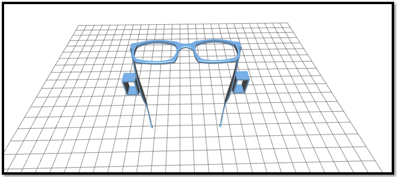
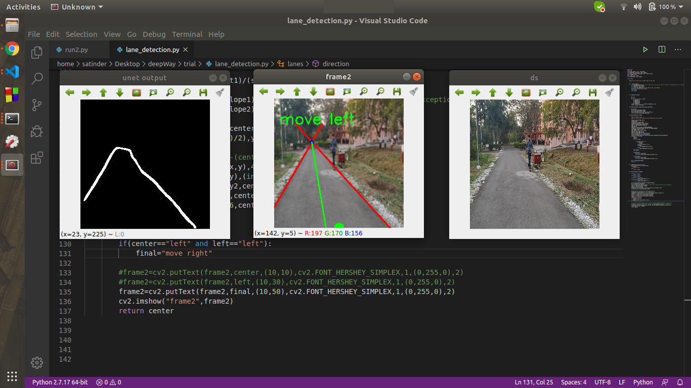

# Ikshana : An Assistant For Specially Visioned
This repository contains the entire project for an aid for the specially visioned, developed using deep learning, particularly convolutional neural networks so that they can navigate easily through the streets. The project provides sensory as well as audio aid to help the blind receive two-step inputs for their easier navigation. 



# Reasons for Ikshana to aim to be a go-to complete solution:<br>
1. **Cost Effectiveness:** The entire project focusses on a budget of less than INR 10000 which is ~$200.
2. **Haptic Sensory Aid:** Blind people generally develop other senses like hearing very well. Sensory aid in terms of viable haptic feedbacks will help the people develop a strong sense of orientation
3. **Compactness:** The entire project has been designed by keeping in mind the implementation on Nvidia Jetson board. The entire project is thus compact in nature and can be carried around/installed very well.

# Hardware Requirements
1. Nvidia Jetson Nano.
2. Arduino Nano.
3. Servo motors (x2)
4. USB audio adapter (as Nvidia Jetson Nano does not have an audio jack)
5. Ethernet cable
6. Web camera
7. Power adapter for Nvidia Jetson Nano
8. Laptop (Nvidia GPU preferred) or any cloud service provider

# Software Requirements (If running on Laptop)
1. Ubuntu machine(16.04 preferred).
2. Install anaconda.
3. Install the required dependencies. Some libraries like pytorch, opencv would require a little extra attention.<br>
> conda env create -f deepWay.yml
4. You can not clone the repository.
5. Change the COM number in the arduno.py file according to your system.
6. Connect the Ardunio nano and USB audio adapter to your PC. 
7. Change CAM to video path instead of 0 for running the system on video.
8. Compile and run arduino Nano code in the arduino nano.
9. Run blindrunner.py

# Software Requirements (Nvidia Jetson Nano)
1. Follow [these](https://developer.nvidia.com/embedded/learn/get-started-jetson-nano-devkit) instructions for starting up with Nvidia Jetson Nano.
2. For connecting headless setup with Nvidia Jetson Nano (using ethernet cable), use the following snippet: <br>
```
ifconfig
Check inet addresss
nmap -sn inet_address/24 --> will return live ip address.
ssh machine_name@ip
Enter password
Now you can connect switch on desktop sharing
Now connect to jetson using Reminna.

```
3. Then, we plan to install the remaining dependencies.

# Methodology of Implementation
### A. Collecting Training Dataset:
The project is an implementation of convolutional neural networks. However, for the very precise implementation of a UNET based project, a correctly labeled dataset of images is a mandate. The collection of datasets we targeted is in labeled terms of “Left”, “Right” and “Centre” parts of the road. The dataset is a target specifically for Indian environments with a combinational detection of human beings and landmarks along with other obstructions.<br><br>


<br>  
    
For UNET, we have a high completion percentage for creation of binary masks for the input data. We have identified the software LabelBox for generating binary masks. The following are the test images for an image we tested our codes on:<br><br> 

<br><br>

For downloading the labelled data from Labelbox, I have made a small utility named "downloader.py". Kindly find it in the repository.
   
### B. Training the Model
We are in process of collection of CNN architectures. The team has currently worked on the model training code and has been able to complete face detection and human identification algorithms. The training of the model for the same is done and tested.<br>


Till the existing pending milestone, we have evaluated the performance of the developed model(s) and chose the one with the best accuracy. We got a training accuracy of about 97% and we expect to get roughly the same accuracy for all the trained models. However, observations depicted that the model in which implemented regularization performed better on the test set. We currently are in process of completion of model architecture for the Keras UNET trainer models. <br>

We trained a lane detection model which would predict the lane (left, center, right) the host was walking in. The following are a few snapshots of the implementation tests on Microsoft Azure: <br>
<br>

#### 1.	Loss v/s Iteration Curve: <br>
<br>
<br>

#### 2. Loss v/s Iteration Curve (For UNET) – Model A: <br>
[Pink: Training, Blue: Validation] <br>


<br><br>

#### 3. Loss v/s Iteration Curve (For UNET) – Model B: <br>


# Important Features:
#### I.	Stop Sign Detection
The aimed model is in process of completion using Python OpenCV. We have been working on the pre-loader model in a pretrained stop sign Haar Cascade model and then identify the location of the stop sign so that the device can steer the blind person.
<br>

#### II. Face Detection
This is being aimed to achieve, using DLibs face detector model. The implementation of the face detection model has been successful for pre-loaded as well as real-time images.
<br>

### C. 3-D Modelling of the Spectacles:
The following is the planned CAD model for the spectacles that hold the haptic sensors: <br>


### D. Pedestrian Detection Using MobileNet V1 SSD: <br>
We aim to use an existing research repository for pedestrian detection planned to be implemented using SSD (Single Shot MultiBox Detector). The detection is heavily influenced by the projects ssd.pytorch and Detectron. The project runs at approximately 10 FPS (individually) on the Jetson Nano and the accuracy too, is aimed to be higher. The design goal is modularity and extensibility. <br><br>
Currently, it has MobileNetV1, MobileNetV2, and VGG based SSD/SSD-Lite implementations. It also has out-of-box support for retraining on Google open images dataset. The following is an aimed detection screenshot:

### E. Results:
1.	Model for lane detection works well, currently runs at approximately 25 FPS on the Jetson Nano. (good for a 30 FPS camera).
2.	The road segmentation model does not work as good as the lane detection one. Though the loss decreases very much but still the output is not as expected. It has been suggested to use focal loss or weighted loss. 
3.	We trained another model using a different UNET architecture in Keras and it seems to perform better
4.	Implementing a naive approach for path planning right now. (Current Assumption: Only pedestrians will be present on the streets)
5.	For pedestrian detection, we plan on using Mobilenet V1 SSD which runs at 5 FPS. I tried to run object detection models in jetson-inference. If runs at approximately 15 FPS (not able to capture frames using OpenCV simultaneously with GStreamer)
6.	In order to cope up with the slow framerate of Mobilenet, we plan on combining it with object tracking. Object detection executes once in 3 seconds to re-seed the object-tracker.
7.	The system aims to run at 3 FPS with the Jetson Nano at 5W with a USB Type-B power supply of 5V, 2A. Research suggests that running the Jetson in 10W mode using a 5V, 4A supply would further improve performance.
<br>


### F. Aims and Upcoming Targets:
1. Collect training data and train a lane detection model
2. Add servo motors feedback support
3. Add sound support
4. 3D printing of spectacles
5. Train UNET model architecture for other tasks such as path planning etc.
6. Improve UNET accuracy (the loss is low; however, the model output(s) are not satisfactory)
7. Drawing lanes (depends upon the improving UNET accuracy)
8. Improving lane detection (by taking averages of lane positions)
9. Pedestrian detection (by tracking for more FPS)
10. Improving speed of pedestrian detection (by using tracking instead of detection)
11. Run optimized models on Jetson Nano (available in Nvidia Jetson Inference)
12. Optimizing the project to run faster on Jetson Nano (conversion of models into Nvidia TensorRT)
13. Adding GPS support for better navigation with path planning along with integration of face recognition support

# References
1. [PyTorch](https://pytorch.org/)
2. [PyImage Search](https://www.pyimagesearch.com/)
3. [PyTorch Community](https://discuss.pytorch.org/)
4. [AWS](https://aws.amazon.com/)
5. [UNET](https://arxiv.org/pdf/1505.04597.pdf)
6. [PyTorch SSD](https://github.com/qfgaohao/pytorch-ssd)
9. [Nvidia Jetson Nano](https://www.jetsonhacks.com/)
10. [TensorFlow 2.0](https://www.tensorflow.org/)
11. [Keras](https://keras.io/)
12. [Advanced Lane Detection - Eddie Forson](https://towardsdatascience.com/teaching-cars-to-see-advanced-lane-detection-using-computer-vision-87a01de0424f)

# Citations

> Labelbox, "Labelbox," Online, 2019. [Online]. Link: https://labelbox.com

